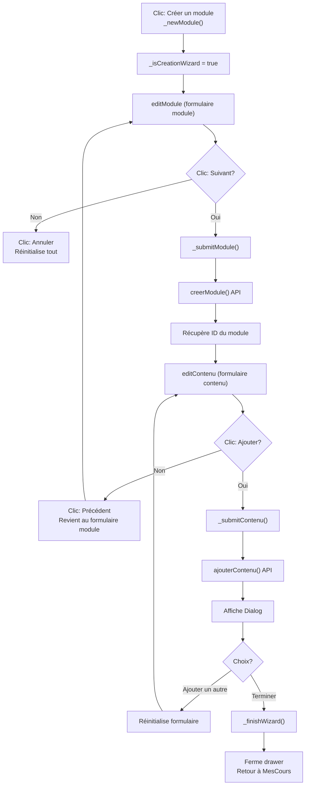

# 🧙 Implémentation du Wizard Module + Contenu

## Résumé
Le drawer de gestion des modules a été transformé en un **wizard linéaire** qui guide l'utilisateur à travers la création d'un module et de son contenu en étapes successives.

## Flux Utilisateur

### 🔵 Démarrage du Wizard
```
Écran Mes Cours
	↓
Clic sur bouton "Créer un module"
	↓
_newModule() active _isCreationWizard = true
	↓
currentStep = ModuleDrawerStep.editModule
```

### ✅ Étape 1: Créer le Module
```
Affichage:
- Titre breadcrumb: "Étape 1: Créer le module"
- Sous-titre: "MonCours • Wizard de création"
- Formulaire: Titre du module + Description

Boutons:
- "Annuler" (gauche) → Annule tout le wizard, revient au selectModule
- "Suivant →" (droite) → Valide et crée le module
```

**Action lors du clic "Suivant →":**
1. Valide les champs (titre et description requis)
2. Appelle `ref.read(coursNotifierProvider.notifier).creerModule(...)`
3. Récupère le nouvel ID du module depuis la liste des modules
4. Stocke l'ID dans `_newlyCreatedModuleId`
5. Passe automatiquement à l'Étape 2 ✨

### 📝 Étape 2: Créer le Contenu
```
Affichage:
- Titre breadcrumb: "Étape 2: Créer le contenu"
- Sous-titre: "Type: VIDEO" (ou autre type sélectionné)
- Formulaire: Titre + Type + Contenu selon le type

Boutons:
- "← Précédent" (gauche) → Revient à Étape 1
- "Ajouter le contenu" (droite) → Valide et crée le contenu
```

**Action lors du clic "Ajouter le contenu":**
1. Valide les champs selon le type
2. Upload le contenu avec `ref.read(coursNotifierProvider.notifier).ajouterContenu(...)`
3. Affiche un **Dialog de choix**:
   - **"Ajouter un autre contenu"** → Revient au formulaire de contenu (réinitialise)
   - **"Terminer et fermer"** → Appelle `_finishWizard()`

### 🎉 Fin du Wizard
```
_finishWizard():
1. _isCreationWizard = false
2. _newlyCreatedModuleId = null
3. currentStep = ModuleDrawerStep.selectModule
4. Navigator.pop(context) → Ferme le drawer
5. L'utilisateur est de retour sur MesCours
```

## Changements de Code

### Variables d'État Ajoutées
```dart
String? _newlyCreatedModuleId;    // Track du module créé
bool _isCreationWizard = false;   // Activation du mode wizard
```

### Méthodes Ajoutées
- `_showWizardNextStepDialog()` → Affiche le dialog de choix final
- `_finishWizard()` → Termine le wizard et ferme le drawer

### Méthodes Modifiées
- `_newModule()` → Active `_isCreationWizard = true`
- `_submitModule()` → Transition automatique vers Étape 2 si wizard activé
- `_submitContenu()` → Affiche dialog au lieu de revenir directement à selectContenu
- `_getBreadcrumbTitle()` → Affiche "Étape 1/2" en mode wizard
- `_getBreadcrumbSubtitle()` → Affiche le contexte du wizard

## Flux Technique



## Points Clés

✅ **Avantages de cette approche:**
- UX linéaire et claire (comme register screen)
- Étapes bien marquées visuellement
- Possibilité d'ajouter plusieurs contenus
- Annulation facile à chaque étape
- Redirection automatique vers MesCours

⚠️ **À tester:**
- La récupération correcte du nouvel ID du module
- La transition fluide entre les étapes
- L'affichage du dialog après création du contenu
- La réinitialisation correcte du formulaire de contenu

## Fichier Modifié
`lms_app/lib/features/enseignant/presentation/widgets/module_management_drawer.dart`

---

**Status:** ✅ Implémenté et compilé avec succès
**Build:** ✅ flutter run compilé sans erreurs critiques
**Date:** 2024
